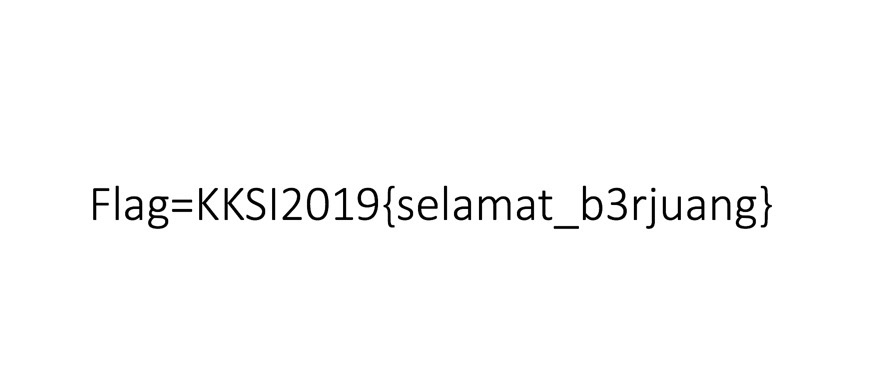

# testing
**Category:** testing  
**Point:** 1

> download dan cari flagnya yahh.. :)

---

Diberikan link yang menuju ke file bernama `flag.jpg.zip` yang dapat di-download. Sudah jelas dari namanya kalau file ini berisi gambar jpg yang dapat di-extract dengan perintah bash `unzip flag.jpg.zip` lalu file `flag.jpg` dibka dengan image viewer. Isi dari gambar tersebut adalah

flag : `KKSI2019{selamat_b3rjuang}`