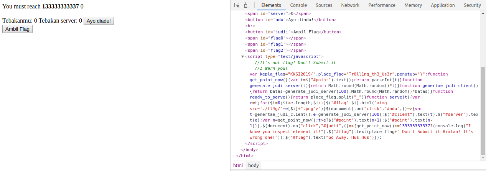
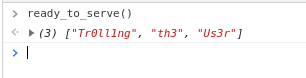
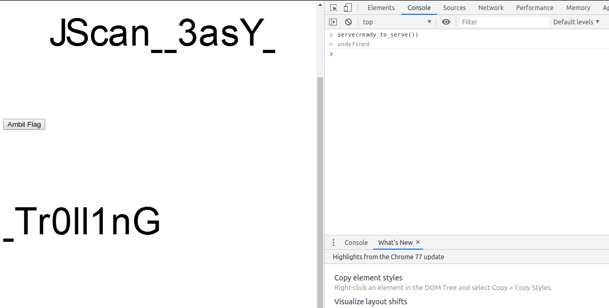

# Tsunade Gambling Master
**Category:** web <br>
**Point:** 100

> http://202.148.2.243:20001
> 
> You have maximum input on this challenge 3 attempts!

---

Diberikan sebuah alamat URL yang merujuk ke sebuah halaman dengan JavaScript yang mencurigakan.



Setelah di-deobfuscate kode JavaScript-nya menjadi seperti berikut:

```javascript
var kepla_flag = "KKSI2019{",
place_flag = "Tr0ll1ng_th3_Us3r",
penutup = "}";
function get_point_now() {
var t = $("#point").text();
return parseInt(t)
}
function generate_judi_server(t) {
return Math.round(Math.random() * t)
}
function genertae_judi_client() {
return batas = generate_judi_server(100), Math.round(Math.random() * batas)
}
function ready_to_serve() {
return place_flag.split("_")
}
function serve(t) {
var e = t;
for ($i = 0; $i < e.length; $i++) $("#flag" + $i).html("")
}
$(document).on("click", "#adu", () => {
var t = genertae_judi_client(),
e = generate_judi_server(100);
$("#client").text(t), $("#server").text(e);
var n = get_point_now();
t > e ? $("#point").text(n + 1) : $("#point").text(n - 1)
}), $(document).on("click", "#judii", () => {get_point_now() >= 133333333337 ? (console.log("I know you inspect element
it!"), $("#flag").text(place_flag + " Don't Submit it Bratan! It's wrong one!")) :
$("#flag").text("Go Away. Hus Hus")
});
```

Kumpulan kode yang terdapat di dalam blok `$(document).on("click", "#adu", ()=>{});` tidak perlu diperhatikan karena tidak ada petunjuk mengenai flag disana (adanya bait alias jebakan). Yang perlu diperhatikan adalah fungsi `ready_to_serve()` dan `serve()` yang pernah dipanggil oleh trigger apapun dari elemen DOM di halaman. Jika fungsi `ready_to_server()` dieksekusi maka hasilnya adalah variabel `place_flag` yang menjadi array (singkatnya).



Kalau dilihat pada fungsi `serve()` nilai dari argumen fungsi tersebut akan dihitung panjangnya pada `e.length` jadi ada kemungkinan kalau parameter yang diminta fungsi tersebut adalah nilai array yang telah didapat dari funsgi `ready_to_serve()` sebelumnya.

Jika fungsi `serve()` dieksekusi dengan argumen dari hasil fungsi `ready_to_serve()` maka



Ada tiga gambar yang muncul di layar, yang jika tulisannya digabung menjadi `JScan_3asY_Tr0ll1nG` yang adalah nilai dari flag challenge ini.

flag : `KKSI2019{JScan_3asY_Tr0ll1nG}`
